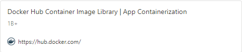
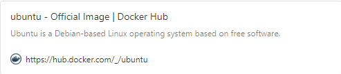
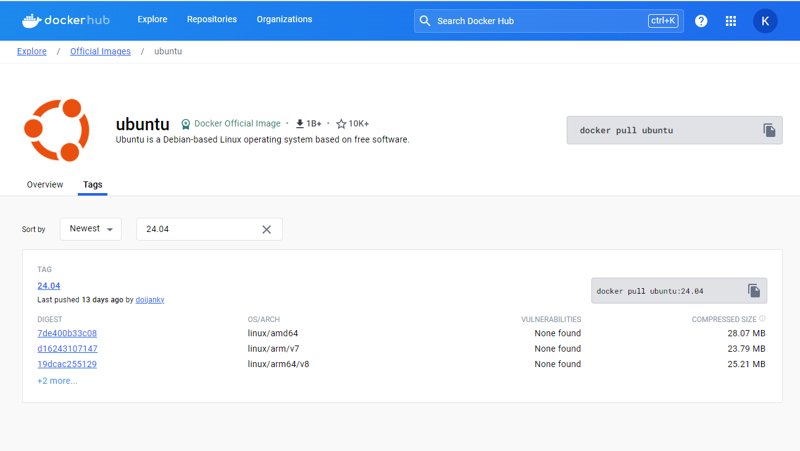
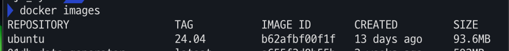
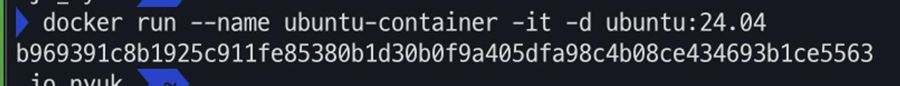
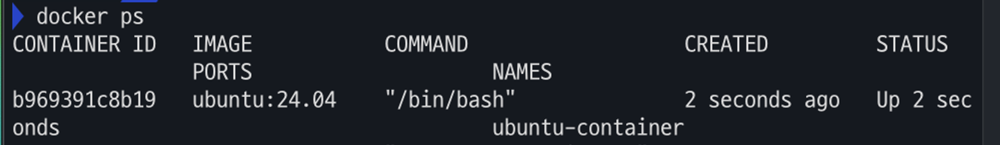
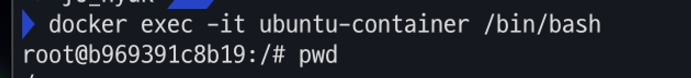

<style>
  @import url('https://fonts.googleapis.com/css2?family=Noto+Sans+KR:wght@400&display=swap');
section {
  font-family: 'Noto Sans KR', 'Arial', sans-serif !important;
}
</style>

# 리눅스 컨테이너 접속하기

---

### Docker Hub 에서 Image 불러와서 Container 띄우기

#### 1. 도커 허브 접속 및 “ubuntu” 검색

<a href="https://hub.docker.com/"></a>
<a href="https://hub.docker.com/_/ubuntu"></a>

---

#### 2. ubuntu > Tags 에서 “24.04” tag pull

   

```bash
docker pull ubuntu:24.04
```

---

#### 3. pull 된 이미지 확인

```bash
docker images
```



---

#### 4. docker image 를 run 하여 container 생성

```bash
docker run --name ubuntu-container -it -d ubuntu:24.04
```



- —name : container 의 이름 지정
- -it : interactive and tty , 사용자가 컨테이너 내부 쉘과 터미널 환경에서 상호작용하도록 해주는 옵션
- -d : detach 모드로 실행, background 에서 실행되도록 설정

---

#### 5. container 잘 실행됐는지 확인

```bash
docker ps
```



---

#### 6. container 접속하기

```bash
docker exec -it ubuntu-container /bin/bash
```

- -it : interactive and tty , 사용자가 컨테이너 내부 쉘과 터미널 환경에서 상호작용하도록 해주는 옵션
- /bin/bash : bash 쉘을 실행하라는 명령어

  

---

#### 7. **패키지 목록 업데이트:**

- Ubuntu 컨테이너를 처음 실행할 때, 패키지 목록을 업데이트하는 것이 좋습니다: **`apt-get update`**.

#### 8. **필요한 도구 및 라이브러리 설치:**

- 기본적으로 Ubuntu 이미지는 최소한의 설치만 제공합니다. 필요한 도구나 라이브러리가 있다면, **`apt-get install`** 명령어를 사용하여 설치해야 합니다.
- 예를 들어, **`apt-get install -y curl`** 명령어는 curl을 설치합니다.
