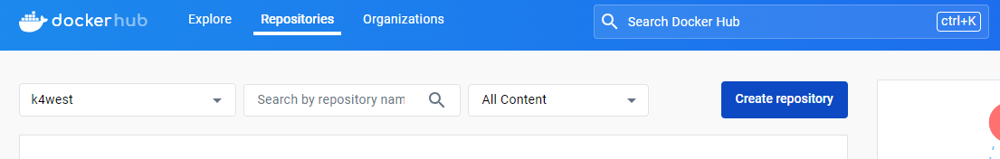

# 도커로 Python 환경 설정

---

## 도커 컨테이너 접속

1. 도커에서 파이썬 [version] 이미지 불러오기

```Bash
docker pull python:[version]
```

2. 도커 컨테이너 띄우기

```Bash
docker run --name [container_name] -it -d python:[version]
```

---

3. 도커 컨테이너 접속하기

```Bash
docker exec -it [container_name]
```

4. vscode에서 접속하는 방법
   a. Extensions에서 Remote Development 설치

   b. Command Palette(Ctrl + Shift + p)에서 dev-containers: Attach to Running Container.. 에서 실행중인 컨테이너 접속

---

## Pyenv를 통해 가상환경(virtualenv) 설정

1. 리눅스(ubuntu)환경 기본 세팅하기

```Bash
# curl ,git ,vim 설치
apt-get update
apt-get install curl , git , vim

#pyenv 설치 전 종속성 해결
apt-get install -y make build-essential libssl-dev zlib1g-dev libbz2-dev libreadline-dev libsqlite3-dev wget llvm libncurses5-dev libncursesw5-dev xz-utils tk-dev libffi-dev liblzma-dev
```

- 타임존 6(한국) > 69(서울)임

---

2. pyenv 설치하기

```Bash
# pyenv 설치
curl https://pyenv.run | bash

# ~/.bashrc (linux), ~/.bash_profile (mac) (bash) 혹은 ~/.zshrc (zsh) 에 pyenv 환경 변수 추가
vi ~/.bashrc (~/.bash_profile, ~/.zshrc)

# ~/.bashrc 파일 가장 아래 쪽에 아래의 명령어 추가
# shift+g 를 입력하면 파일의 가장 아래쪽으로 이동합니다.
export PATH="~/.pyenv/bin:$PATH"
eval "$(pyenv init --path)"
eval "$(pyenv init -)"

eval "$(pyenv virtualenv-init -)"

# 위의 사항을 ~/.bashrc (bash) 혹은 ~/.zshrc ㅣ(zsh) 에 입력하고 해당 사항을 저장합니다.
source ~/.bashrc (source ~/.zshrc)

# shell 재실행
exec $SHELL
```

---

3. python 런타임 설치

```Bash
# 설치 할 수 있는 버전 확인
pyenv versions | <PYTHON_VERSION>
# e.g. pyenv versions | 3.7

# 메이저 버전 중 가장 최신 버전을 설치합니다.
pyenv install <PYTHON_VERSION>
# e.g. pyenv install 3.7.x
```

---

4.  virtualenv 를 이용한 가상환경 설정

```Bash
# 설치된 pyenv 환경 중 원하는 파이썬 버전을 활성화합니다. (예) Python 3.8.10)
pyenv shell <PYTHON_VERSION>

# 설치된 파이썬 버전은 다음 명령어로 확인할 수 있습니다.
pyenv versions
## 예시
# system
# * 3.8.10 (set by PYENV_VERSION environment variable)

# 원하는 이름의 virtualenv 생성
pyenv virtualenv 3.8.10 "env 이름"

# 가상환경 활성화
pyenv activate "env 이름"

# 가상환경 비활성화
pyenv deactivate
```

---

## 변경된 이미지 허브에 남기기

1. docker hub 회원가입 및 레포만들기

2. 실행중인 컨테이너 기반 새로운 이미지 만들기
   docker commit <컨테이너 ID 또는 이름> <새 이미지 이름>

3. 만들진 이미지 허브에 푸시하기

```Bash
# 이미지 푸시하기 전 도커 허브 로그인
docker login # 사용자 이름과 비번 입력

docker push username/repo:tag
```

---

## 도커 컨테이너 접속

1. docker hub 회원가입 및 레포만들기
   

2. 실행중인 컨테이너 기반 새로운 이미지 만들기
   ```Bash
   docekr commit <컨데이너 ID 또는 이름> <새 이미지 이름>
   ```
   <p class="s">commit : 변경 사항 저장</p>

---

3. 만들어진 이미지 허프에 푸시

   ```Bash
   # 이미지에 푸시하기 전 도커 허브 로그인
   docker login <아이디> <비밀번호>

   # 푸시하기 전에 태킹
   docker tag <loacl-image:tagname> <new-repo:tagname>


   docker push <new-repo:tagnanme>
   ```

   <p class="s">new-repo = username/repo</p>
