<style>
  @import url('https://fonts.googleapis.com/css2?family=Noto+Sans+KR:wght@400&display=swap');
section {
  font-family: 'Noto Sans KR', 'Arial', sans-serif !important;
}
</style>

# 명령어 연습

---

### 컨테이너 생성 및 접속 복습

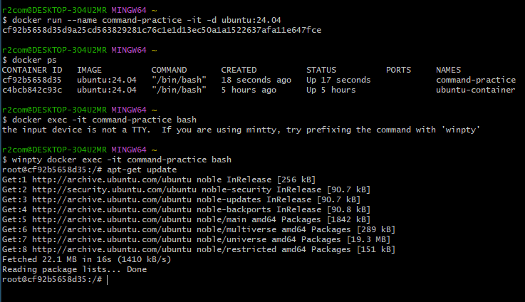

<p>저는 경로가 다른지 bin/bash는 오류가 나와서 bash만 쳤고, </br> window 환경에서 git bash를 이용하고 있어서 docker 앞에 winpty를 적었습니다.</p>

---

### 1. 디렉토리 및 파일 생성

- **`mkdir my_folder`**: "my_folder"라는 이름의 폴더를 생성합니다.
- **`cd my_folder`**: 생성한 "my_folder" 폴더로 이동합니다.
- **`touch file1.txt file2.txt file3.txt`**: "my_folder" 내에 "file1.txt", "file2.txt", "file3.txt"라는 세 개의 파일을 생성합니다.

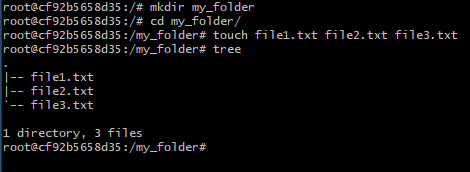

<p><b>tree</b> 명령어를 사용하기 위해서 먼저 <b>apt-get install tree</b>를 해야 합니다.</p>

---

### 2. 파일 및 디렉토리 조회

- **`ls -a`**: 숨겨진 파일을 포함하여 현재 폴더의 모든 파일과 폴더를 나열합니다.
- **`ls -l`**: 파일과 폴더의 상세 정보(권한, 소유자, 크기 등)를 나열합니다.
- **`pwd`**: 현재 작업 중인 폴더의 경로를 출력합니다.

### 3. 디렉토리 변경

- **`cd ..`**: 상위 폴더로 이동합니다.

---

<div class="columns">

파일 및 디렉토리 조회/ 변경
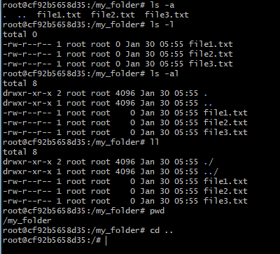

쉘에서 명령어 실행 결과 출력
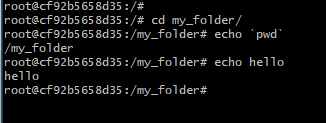

</div>

---

### 4. 쉘에서 명령어 실행 결과 출력

- **`echo `pwd``** : 현재 폴더의 경로를 출력합니다.

### 5. 파일 및 폴더 복사

- **`cp file1.txt backup_file1.txt`**: "file1.txt"를 "backup_file1.txt"로 복사합니다.
- **`mkdir backup_folder`**: "backup_folder"라는 이름의 폴더를 생성합니다.
- **`cp -r my_folder backup_folder`**: "my_folder" 폴더를 "backup_folder"로 재귀적으로 복사합니다.

---

최상단 경로에 기본 폴더가 많아서 root 폴더에서 폴더를 생성하고
cp(복사) 명령어로 파일과 폴더를 복사했습니다.

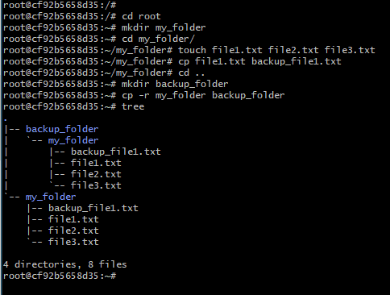

touch는 빈 파일을 생성하는 명령어 입니다.

폴더를 복사하는데 있어서는 하위 목록도 함께 복사하기 때문에
-r 옵션이 필요합니다.

---

### 6. Vim 에디터 사용

- **`vi file1.txt`**: "file1.txt" 파일을 Vim 에디터로 엽니다. 여기서 dd, x, yy, p 명령어를 사용할 수 있습니다.
  <br/>
  <br/>

### 7. Bash 스크립트 실행

- 현재 워킹디렉토리(pwd 로 확인) 에다가 vim [script.sh](http://script.sh) 로 파일 생성
- **`bash script.sh`**: "script.sh"라는 이름의 Bash 스크립트를 실행합니다.

---

- `apt-get install vim` : `vim` 설치
- 설치 중 진행을 위해 `Y`를 입력하고, 대륙과 도시를 선택해야 합니다.
- 처음에는 대륙은 `5`(asia)번, 도시는 `68`(seoul)번 입니다.

</br>
</br>

<div class="columns">

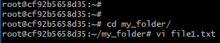
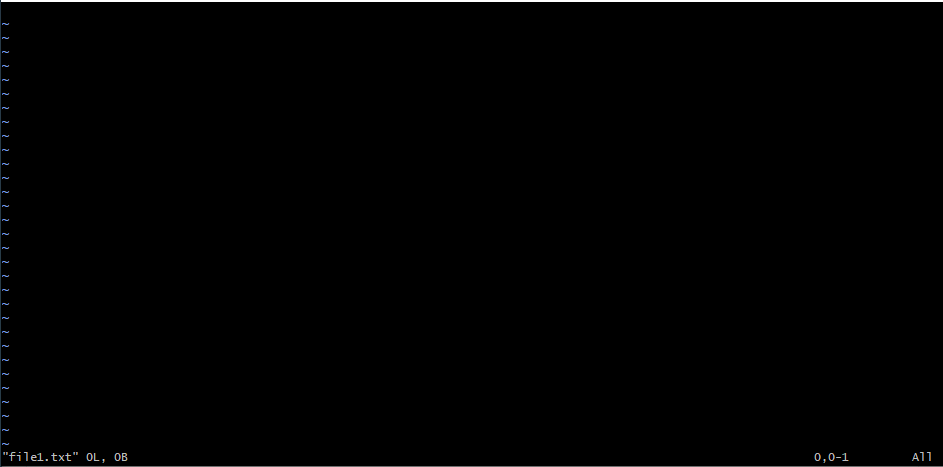

<section class="descr"></section>
<section class="descr">vim editor</section>

</div>

---

<div class="columns">

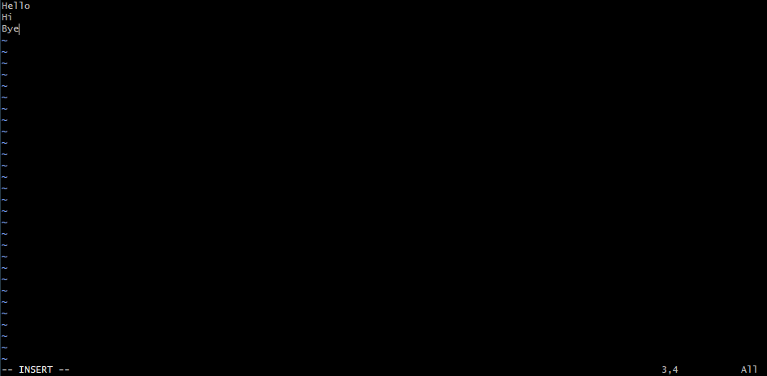


<section class="descr">i를 누르면 INSERT 모드로 들어감</section>
<section class="descr">
    ESC를 누르면 INSERT 모드에서 나옴
    :q를 누르면 그냥 나옴
    문서 수정 후 저장 없이 나오고 싶으면 :q!를 눌러야함
    문서 수정 후 저장하고 나오려면 :wq 또는 :wq!를 누르면 됨
</section>
</div>

---

### 8. 관리자 권한으로 명령 실행

- **`sudo rm -rf my_folder`**: "my_folder" 폴더를 관리자 권한으로 강제로 삭제합니다.
<p>sudo 명령어도 실행하려면 apt-get install sudo로 설치해야합니다.</p>

</br>
</br>

### 9. 파일 이동 및 이름 변경

- **`mv file2.txt my_folder/`**: "file2.txt" 파일을 "my_folder" 폴더로 이동합니다.
- **`mv file3.txt new_file3.txt`**: "file3.txt" 파일의 이름을 "new_file3.txt"로 변경합니다.

---

- `mv 파일명 폴더명`: 파일을 폴더로 이동

- `mv 파일명1 파일명2`: 파일명1을 파일명2로 바꿈
<p>mv는 경로를 바꾸기 때문에 파일명2가 새로운 경로가 되어 이름이 변경됩니다.</p>

<br>
<br>

오른쪽 예시:

`touch file4.txt`: file4.txt를 root에 생성

`mv file4.txt my_folder`: file4.txt를 my_folder로 이동

`mv file4.txt new_file4.txt`: file4.txt를 new_file4.txt로 이름 변경

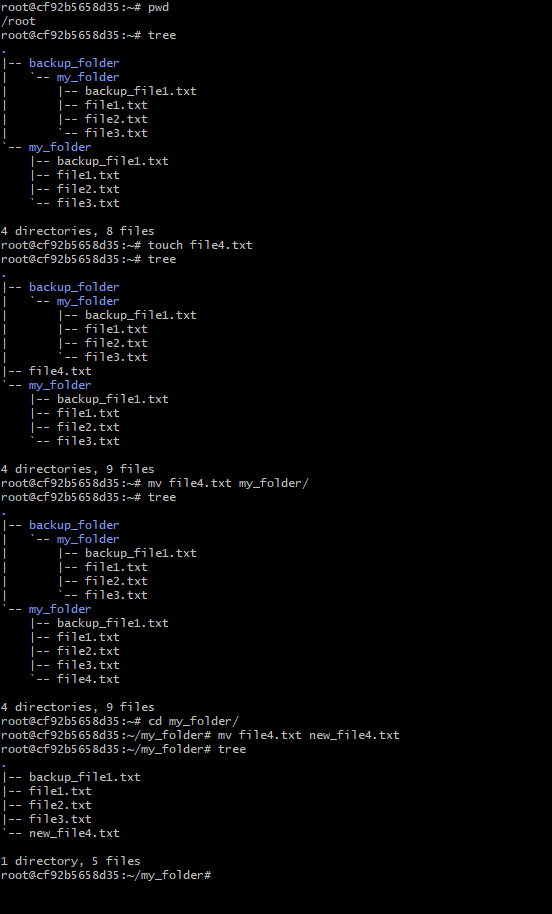

---

### 10. 파일 내용 출력 및 병합

- **`cat file1.txt`**: "file1.txt" 파일의 내용을 출력합니다.
- **`cat file1.txt file2.txt >> merged_file.txt`**: "file1.txt"와 "file2.txt"의 내용을 "merged_file.txt"에 병합하여 추가합니다.

<br>
<br>

<div class="columns">
<div>

### 11. 명령어 창 클리어

- **`clear`**: 명령어 창을 정리합니다.
</div>

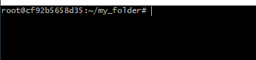

## </div>

---

<br/>

`cat file1.txt file2.txt >> merged_file.txt`
`>>`는 기존 문서에 이어붙이는 방식입니다.

<br/>
<br/>

`cat file1.txt file2.txt > merged_file.txt`
`>`는 덮어쓰는 방식입니다.

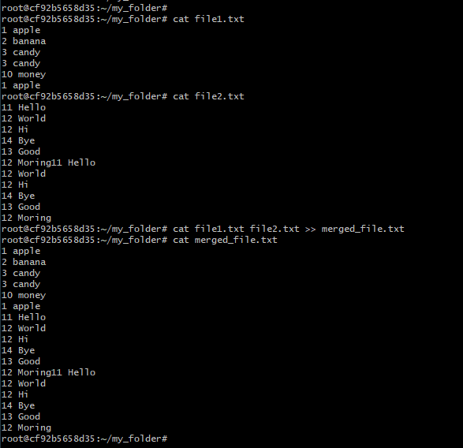

---

### 12. 사용한 명령어 히스토리 확인

- **`history`**: 사용한 명령어 목록을 보여줌
- **`!5`**: 히스토리의 5번째 명령어를 실행

### 13. 파일 및 디렉토리 검색

- **`find . -name "file1.txt"`**: 현재 디렉토리 및 하위에서 "file1.txt"라는 이름의 파일/디렉토리를 검색합니다.

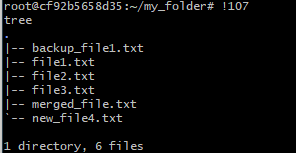<br/><b>!숫자</b>를 입력하면 해당 history의 명령어가 실행됨</img>

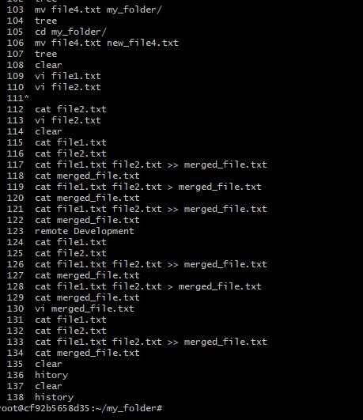

---

### 14. 환경 변수 설정

- **`export MY_VARIABLE="test"`**: "MY_VARIABLE"라는 이름의 환경 변수를 "test" 값으로 설정합니다.

### 15. 폴더 구조 트리 형태로 보기

- **`tree -L 2`**: 현재 디렉토리의 폴더 구조를 2단계까지 트리 형태로 보여줍니다.

```bash
root@cf92b5658d35:~/my_folder# export MY_VARIABLE="test"
root@cf92b5658d35:~/my_folder# echo $MY_VARIABLE
test
root@cf92b5658d35:~/my_folder# export run_pwd=`pwd`
root@cf92b5658d35:~/my_folder# $run_pwd
bash: /root/my_folder: Is a directory
root@cf92b5658d35:~/my_folder# export run_pwd=pwd
root@cf92b5658d35:~/my_folder# $run_pwd
/root/my_folder
root@cf92b5658d35:~/my_folder#
```

---

### 16. 파일의 앞/뒤 내용 출력

- **`head -n 3 file1.txt`**: "file1.txt" 파일의 앞에서부터 3줄을 출력합니다.
- **`tail -n 3 file1.txt`**: "file1.txt" 파일의 뒤에서부터 3줄을 출력합니다.

```bash
root@cf92b5658d35:~/my_folder# cat file1.txt
1 apple
2 banana
3 candy
3 candy
10 money
1 apple
root@cf92b5658d35:~/my_folder# head -n 3 file1.txt
1 apple
2 banana
3 candy
root@cf92b5658d35:~/my_folder# tail -n 3 file1.txt
3 candy
10 money
1 apple
```

---

### 17. 파일 내용 정렬 및 중복 제거

- **`cat file1.txt | sort -n`**: "file1.txt" 파일의 내용을 숫자 기준으로 정렬합니다.
- **`cat file1.txt | uniq`**: "file1.txt" 파일의 내용 중 연속적으로 중복되는 줄을 제거합니다.

```bash
root@cf92b5658d35:~/my_folder# cat file1.txt | sort -n
1 apple
1 apple
2 banana
3 candy
3 candy
10 money
root@cf92b5658d35:~/my_folder# cat file1.txt | uniq
1 apple
2 banana
3 candy
10 money
1 apple
```

---

```bash
root@cf92b5658d35:~/my_folder# cat file1.txt | sort -n | uniq
1 apple
2 banana
3 candy
10 money
root@cf92b5658d35:~/my_folder# cat file1.txt | uniq | sort -n
1 apple
1 apple
2 banana
3 candy
10 money

```

---

### 18. 특정 파일 이름 검색

- **`grep [옵션][패턴][파일명]`**: 입력으로 전달된 파일의 내용에서 특정 문자열을 찾고자할 때 사용하는 명령어

<br/>

smaple.txt

```txt
Hello, World!
hello, world!
HELLO, WORLD!
Linux is great.
linux is Great.
This is a Test line.
This is a test line.
Find the word 'Linux'.
Find the word 'linux'.
```

---

<div class="columns">
<div>

##### 1. 대소문자 구분 없이 단어 검색 (-i)

`grep -i 'linux' sample.txt`: 파일 내 대소문자 구분 없이 'linux'라는 단어

##### 2. 정확한 단어 (-w)

`grep -w 'is' sample.txt`: 'is'라는 단어가 정확히 포함된 라인

##### 3. 특정 패턴을 제외 (-v)

`grep -v 'Linux' sample.txt`: 'Linux'라는 단어를 포함하지 않는 라인

</div>
<div>

##### 4. 정규 표현식 (-E)

`grep -E '^This.*line\.$' sample.txt`: 'This'로 시작하고, 'line'으로 끝나는 라인

##### 5. 대소문자 구분 없이 정확한 단어 검색 (-iw)

`grep -iw 'hello' sample.txt`: 대소문자 구분 없이 'hello'라는 단어가 정확히 포함된 라인

</div>

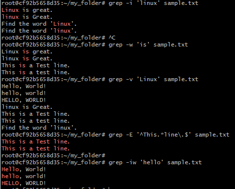
